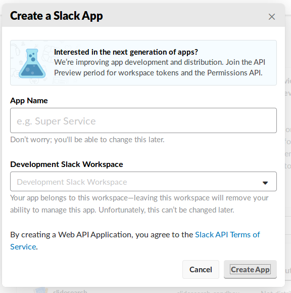
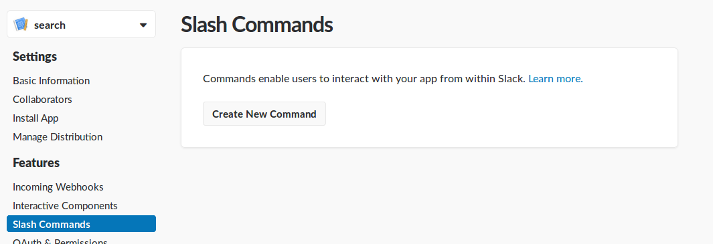

## Motivation

blueprint to implement commands on slack. Commands may be used to:

* run a job on a server
* run a deployment
* send a SMS to inform you will be in late to a co-worker
* show the number of bike in the velib station close your office
* ...

## Synopsis

The technical stack for this blueprint use :

* [Flask](http://flask.pocoo.org/) - web application 
* [Flask-Slack](https://github.com/VeryCB/flask-slack) - slack router for messaging
* [Zappa](https://github.com/Miserlou/Zappa) - packaging and dev deployment on AWS Lambda and AWS Api Gateway

Requirements :

* python 3.6 - runtime
* a slack channel and its [team id](https://stackoverflow.com/a/44883343)
* AWS tenant and a pair of API keys

## The latest version

You can find the latest version to ...

```bash
git clone https://github.com/FabienArcellier/blueprint-slack-command-serverless.git
```

## Installation

installation is done in 2 steps :

* build and deploy a dev environment on AWS
* create a slack application

going further :

* deploy on production
* debug in local

### build and deploy a dev environment

use the command ``init`` to configure a zappa environment

```bash
scripts/init
```

deploy the application

```bash
zappa deploy dev
```

more information on [how to configure your AWS credentials]()

### create a slack application

1. create a new slack application



2. create a new slack command



### deploy on production

Zappa is provisioning ressources on AWS as Cloudformation to deploy AWS Api Gateway or S3 bucket. 
I recommend to use a consistent strategy to manage AWS resources on the tenant.

It's better to give the software factory the right to only deploy the lambda package.

Zappa allow you to build the package and deploy it with your own provisionner. 
It can as well generate the cloudformation template.


### debug in local

As the bot is a Flask application, you can run it in local in debug mode instead on AWS.

```bash
FLASK_APP=bot.py flask run
```

To route slack command to your computer, you can use  [ngrok](https://ngrok.com/). It give you a public url that forward
your query on localhost

## Contributors

* Fabien Arcellier

## License

```
MIT License

Copyright (c) 2018 Fabien Arcellier

Permission is hereby granted, free of charge, to any person obtaining a copy
of this software and associated documentation files (the "Software"), to deal
in the Software without restriction, including without limitation the rights
to use, copy, modify, merge, publish, distribute, sublicense, and/or sell
copies of the Software, and to permit persons to whom the Software is
furnished to do so, subject to the following conditions:

The above copyright notice and this permission notice shall be included in all
copies or substantial portions of the Software.

THE SOFTWARE IS PROVIDED "AS IS", WITHOUT WARRANTY OF ANY KIND, EXPRESS OR
IMPLIED, INCLUDING BUT NOT LIMITED TO THE WARRANTIES OF MERCHANTABILITY,
FITNESS FOR A PARTICULAR PURPOSE AND NONINFRINGEMENT. IN NO EVENT SHALL THE
AUTHORS OR COPYRIGHT HOLDERS BE LIABLE FOR ANY CLAIM, DAMAGES OR OTHER
LIABILITY, WHETHER IN AN ACTION OF CONTRACT, TORT OR OTHERWISE, ARISING FROM,
OUT OF OR IN CONNECTION WITH THE SOFTWARE OR THE USE OR OTHER DEALINGS IN THE
SOFTWARE.
```
